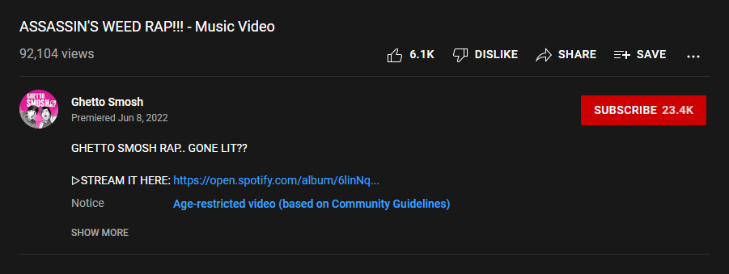
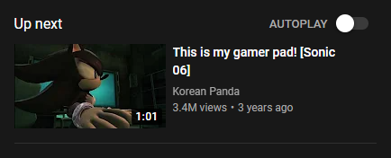

## ⚠ ONLY WORKS IN ENGLISH! ⚠
## ⚠ PLEASE SEE [LOCALIZATION.MD](LOCALIZATION.md) ⚠

# Watch9 Reconstruct
Introduced in 2017, Watch9 was the Watch page's layout up until 2019. This userscript aims to restore that layout.

# Screenshots

# FaQ
**Q: How do I change options?**

A: There's a constant variable at the start of the script which holds the options, change those.

**Q: Why is it called Watch9?**

A: The layout that came before was known internally as Watch8, the one before as Watch7, the one before as Watch6, etc. etc. So it made the most logical sense to call this one Watch9.

# Old versions
You can find old versions on the [Greasy Fork page](https://greasyfork.org/en/scripts/447194-watch9-reconstruct), although it is HIGHLY RECOMMENDED that you DO NOT use these versions as they are riddled with bugs.